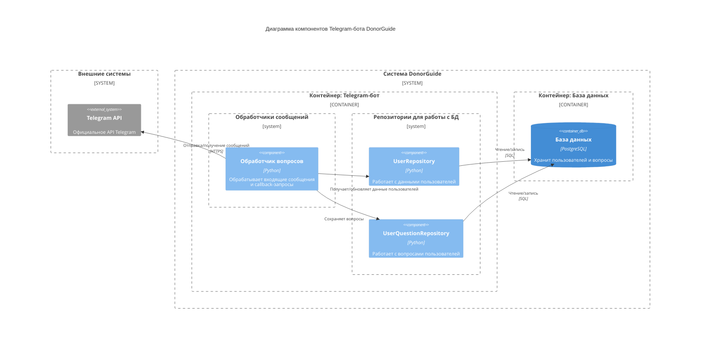

# Диаграмма компонентов
Диаграмма компонентов показывает внутреннюю структуру контейнера, разбивая его на логические компоненты (модули, классы, сервисы) и связи между ними.

Диаграмма отображает внутреннюю структуру системы  на уровне компонентов. Система разделена на два основных контейнера:
1. Контейнер Telegram-бота включает:
  - Обработчики сообщений (принимают и маршрутизируют запросы).
  - Репозитории (работают с данными через БД).
2. Контейнер базы данных:
  - PostgreSQL (хранит данные пользователей и их вопросы)

Ключевые взаимодействия:
- Бот обменивается сообщениями через Telegram API.
- Обработчик координирует работу с данными через репозитории.
- Репозитории работают с базой данных.