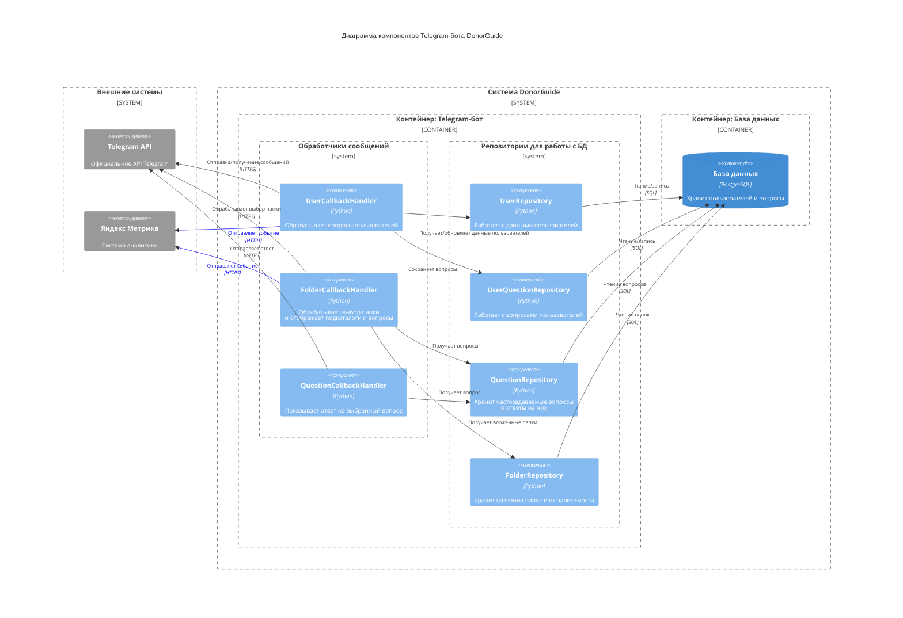

# Диаграмма компонентов
Диаграмма компонентов показывает внутреннюю структуру контейнера, разбивая его на логические компоненты (модули, классы, сервисы) и связи между ними.

Диаграмма отображает внутреннюю структуру системы  на уровне компонентов. Система разделена на два основных контейнера:
1. Контейнер Telegram-бота содержит два логических блока:

    - Обработчики (handlers) — принимают callback-запросы и маршрутизируют их:
        - UserCallbackHandler: реагирует на вопросы пользователей;
        - FolderCallbackHandler: обрабатывает выбор папки и отображает вложения;
        - QuestionCallbackHandler: показывает ответ на выбранный вопрос.

    - Репозитории (repos) — получают и сохраняют данные в базу:

        - UserRepository: сохраняет и извлекает информацию о пользователях Telegram;
        - UserQuestionRepository: регистрирует вопросы, которые пользователи задают вручную;
        - QuestionRepository: предоставляет доступ к базе часто задаваемых вопросов и их ответов;
        - FolderRepository: управляет иерархией категорий и подкатегорий вопросов.

2. Контейнер базы данных
    - PostgreSQL — централизованное хранилище всех данных пользователей, вопросов и структуры папок.

Взаимодействие с внешними системами
- Telegram API — для отправки/получения сообщений и callback-запросов.
- Яндекс Метрика — получает события взаимодействия пользователей для аналитики.
