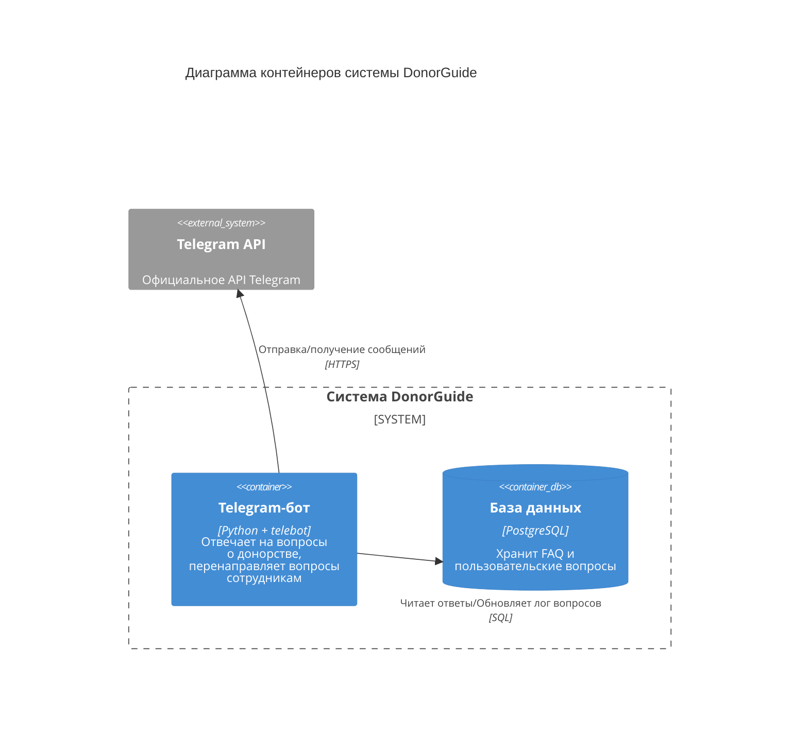

# Диаграмма контейнеров
Диаграмма контейнеров C4 показывает высокоуровневую архитектуру системы, выделяя основные подсистемы внутри границ рассматриваемой системы и их взаимодействие с внешними системами.

## Описание контейнеров:
1. Telegram-бот (Python + telebot):
- Ответы на вопросы о донорстве крови.
- Прием обращений пользователей и перенаправление сотрудникам фонда.
2. База данных (PostgreSQL):
- Содержит структурированные FAQ.
- Хранит историю обращений.

## Внешние системы:
1. Telegram — платформа для работы бота. Обеспечивает коммуникацию с пользователями.