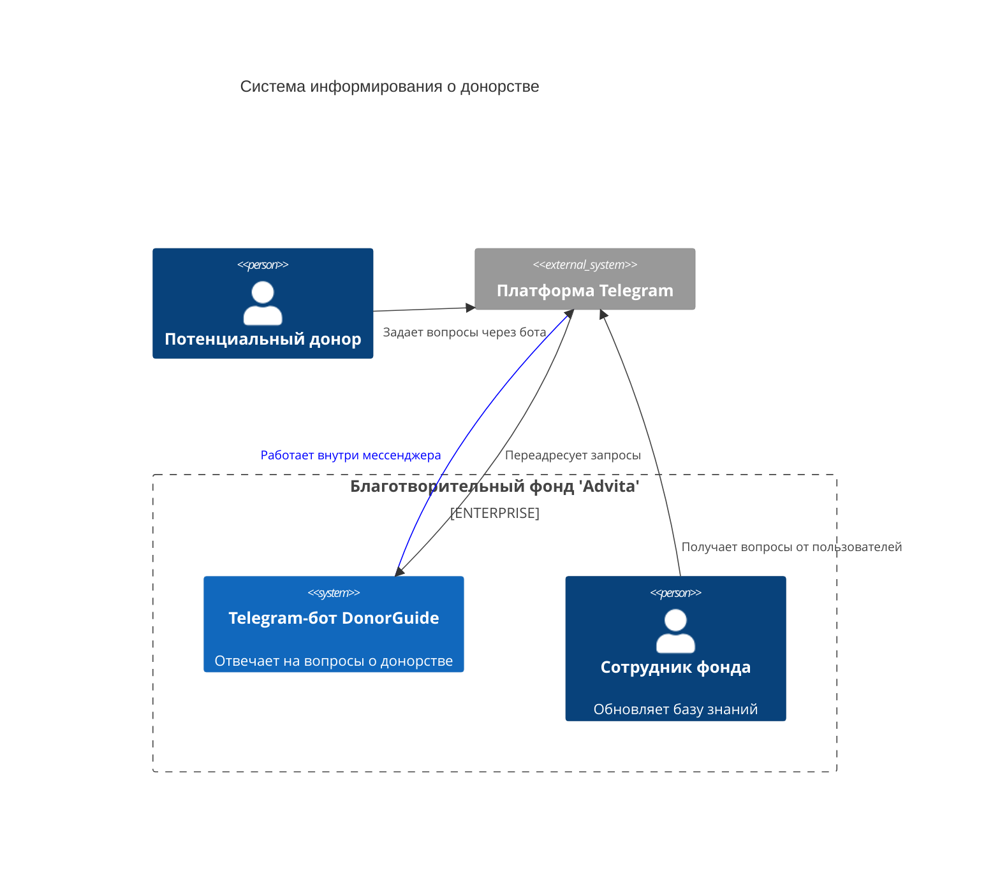

# Диаграмма Контекста
 Диаграмма показывает систему в масштабе ее взаимодействия с пользователями и другими системами.

## Описание компонентов:
1. DonorGuide Bot. Telegram-бот, отвечающий на вопросы о донорстве крови и костного мозга.
2. Сотрудник фонда. Администрирует базу знаний: добавляет новые вопросы/ответы и обрабатывает индивидуальные запросы.
3. Потенциальный донор. Основной пользователь, взаимодействующий с ботом для получения информации.

## Внешние системы:
1. Telegram — платформа для работы бота, передаёт запросы от пользователей в DonorGuide и отображает ответы.

## Взаимодействия:
1. Потенциальные доноры задают вопросы через Telegram-бота.
2. Telegram пересылает сообщения в DonorGuide.
3. DonorGuide отвечает на частые вопросы, используя базу знаний.
4. Индивидуальные вопросы автоматически пересылаются сотрудникам фонда.

