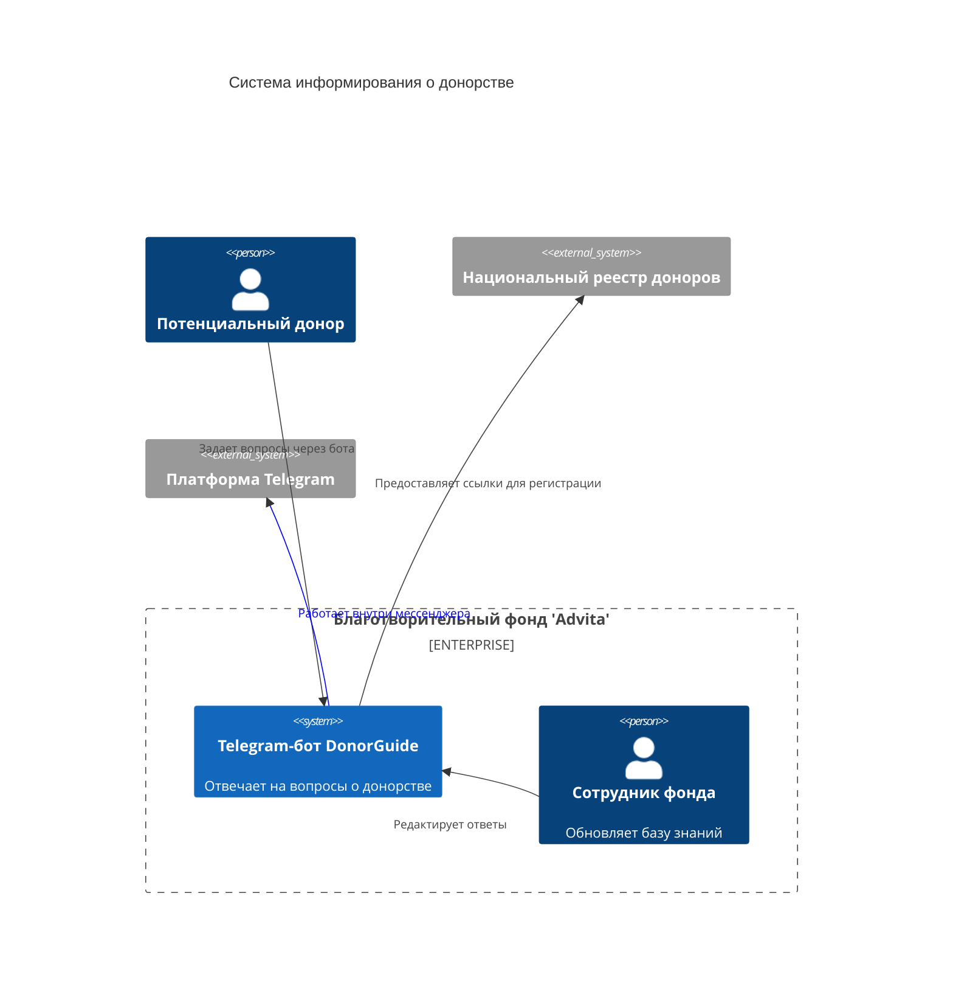

# Контекст-диаграмма (System context)

## Описание компонентов:
1. DonorGuide Bot. Telegram-бот, отвечающий на вопросы о донорстве крови и костного мозга.
2. Сотрудник фонда. Администрирует базу знаний: добавляет новые вопросы/ответы и обрабатывает индивидуальные запросы.
3. Потенциальный донор. Основной пользователь, взаимодействующий с ботом для получения информации.

## Внешние системы:
1. Национальный реестр доноров — предоставляет данные для регистрации.
2. Telegram — платформа для работы бота.

## Взаимодействия:
1. Пользователи задают вопросы через бота.
2. Бот предоставляет ответы из базы знаний или ссылки на внешние ресурсы.
3. Сотрудник фонда обновляет контент бота.