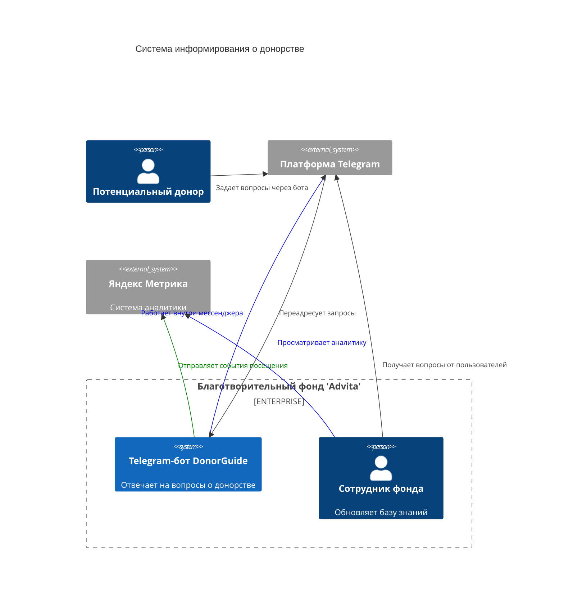

# Диаграмма Контекста
 Диаграмма показывает систему в масштабе ее взаимодействия с пользователями и другими системами.

## Описание компонентов:
1. DonorGuide Bot. Telegram-бот, отвечающий на вопросы о донорстве крови и костного мозга.
2. Сотрудник фонда. Администрирует базу знаний: добавляет новые вопросы/ответы и обрабатывает индивидуальные запросы.
3. Потенциальный донор. Основной пользователь, взаимодействующий с ботом для получения информации.

## Внешние системы:
1. Telegram — платформа для работы бота, передаёт запросы от пользователей в DonorGuide и отображает ответы.
2. Яндекс Метрика — система аналитики, в которую бот отправляет события взаимодействия.

## Взаимодействия:
1. Донор задаёт вопрос через Telegram.
2. Telegram передаёт запрос в DonorGuide.
3. DonorGuide отправляет ответ или пересылает вопрос сотруднику.
4. DonorGuide фиксирует события в Яндекс Метрике.
5. Сотрудник анализирует поведение пользователей через интерфейс Яндекс Метрики.
