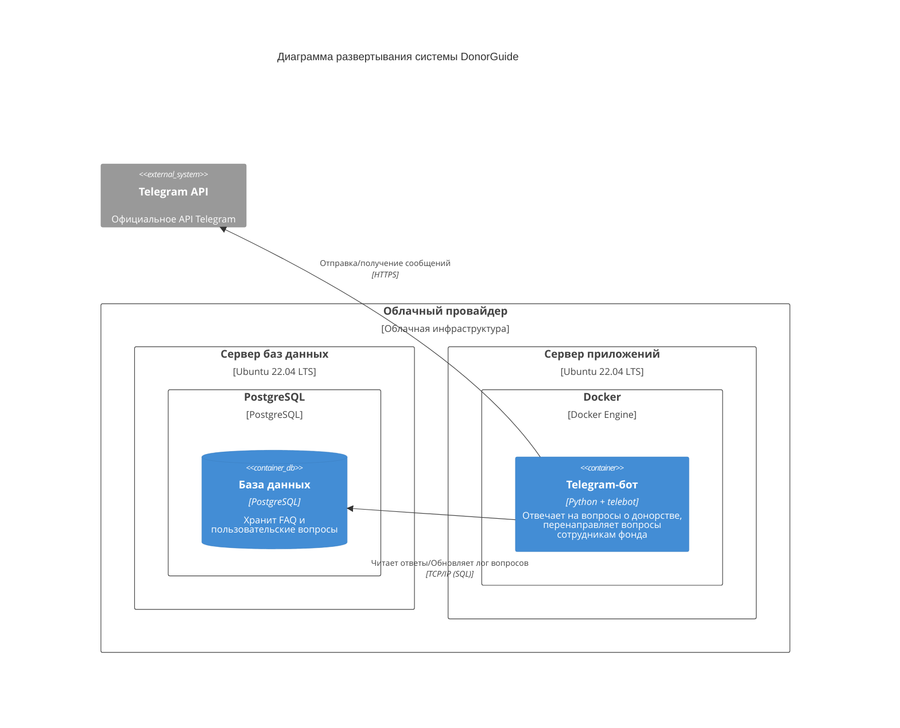

# Диаграмма развертывания
Диаграмма развертывания C4 показывает физическую инфраструктуру системы DonorGuide, включая расположение контейнеров на серверах и их взаимодействие, в том числе с внешними системами.

## Описание узлов:
1. Сервер баз данных:
  - Виртуальная машина с Ubuntu 22.04 LTS, арендованная у облачного провайдера
  - Установлен PostgreSQL 17
  - Хранит данные приложения (FAQ, логи вопросов)
2. Сервер приложений:
  - Виртуальная машина с Ubuntu 22.04 LTS, арендованная у облачного провайдера
  - Устновлен Docker 28
  - В контейнере работает Python-приложение бота

# Особенности развертывания:
- Используются два изолированных сервера для БД и приложения
- Все компоненты развернуты в облачной инфраструктуре
