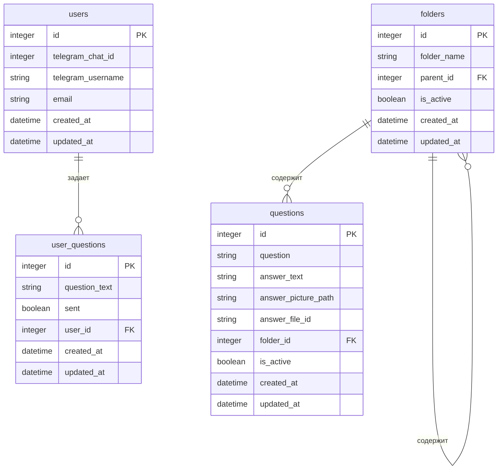

## ER-диаграмма базы данных

```mermaid
erDiagram
    users {
        integer id PK
        integer telegram_chat_id
        string telegram_username
        string email
        datetime created_at
        datetime updated_at
    }
    
    user_questions {
        integer id PK
        string question_text
        boolean sent
        integer user_id FK
        datetime created_at
        datetime updated_at
    }

    folders{
        integer id PK
        string folder_name
        integer parent_id FK
        boolean is_active
        datetime created_at
        datetime updated_at
    }

    questions{
        integer id PK
        string question
        string answer_text
        string answer_picture_path 
        string answer_file_id 
        integer folder_id FK
        boolean is_active
        datetime created_at
        datetime updated_at
    }

    users ||--o{ user_questions : "задает"
    folders ||--o{ folders : "содержит"
    folders ||--o{ questions : "содержит"

```
