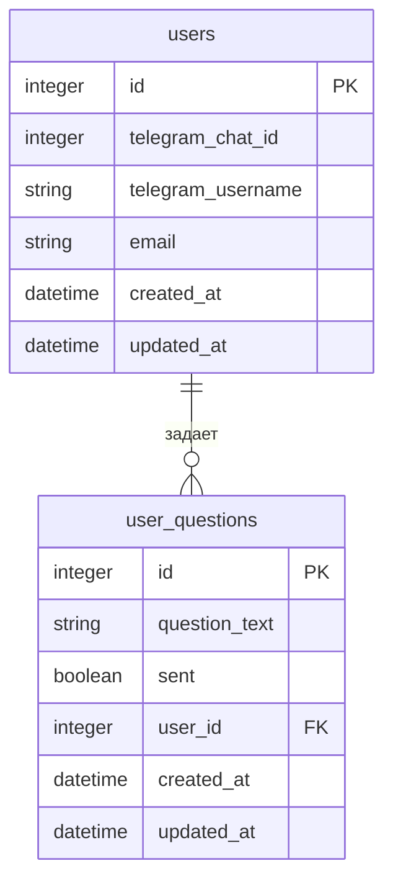

## ER-диаграмма базы данных

```mermaid
erDiagram
    users {
        integer id PK
        integer telegram_chat_id
        string telegram_username
        string email
        datetime created_at
        datetime updated_at
    }
    
    user_questions {
        integer id PK
        string question_text
        boolean sent
        integer user_id FK
        datetime created_at
        datetime updated_at
    }

    users ||--o{ user_questions : "задает"
```
