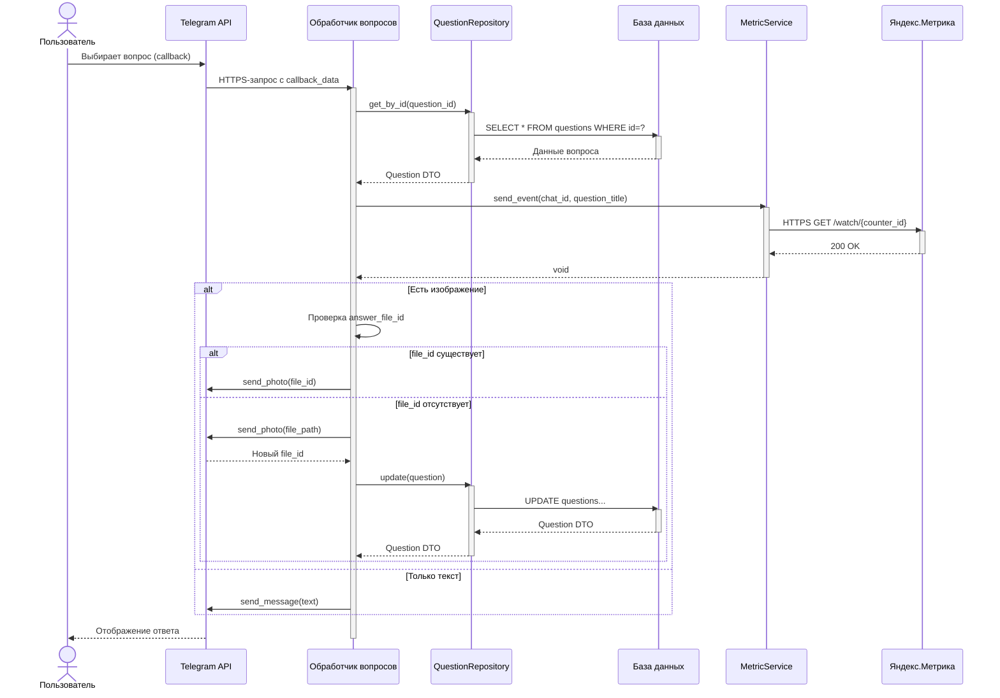

## Диаграмма обработки вопроса

```mermaid
sequenceDiagram
    actor Пользователь as Пользователь
    participant Telegram as Telegram API
    participant Обработчик as Обработчик вопросов
    participant QuestionRepo as QuestionRepository
    participant DB as База данных
    participant MetricService as MetricService
    participant ЯндексМетрика as Яндекс.Метрика

    Пользователь->>Telegram: Выбирает вопрос (callback)
    Telegram->>Обработчик: HTTPS-запрос с callback_data
    activate Обработчик

    Обработчик->>QuestionRepo: get_by_id(question_id)
    activate QuestionRepo
    QuestionRepo->>DB: SELECT * FROM questions WHERE id=?
    activate DB
    DB-->>QuestionRepo: Данные вопроса
    deactivate DB
    QuestionRepo-->>Обработчик: Question DTO
    deactivate QuestionRepo

    Обработчик->>MetricService: send_event(chat_id, question_title)
    activate MetricService
    MetricService->>ЯндексМетрика: HTTPS GET /watch/{counter_id}
    
    activate ЯндексМетрика
    ЯндексМетрика-->>MetricService: 200 OK
    deactivate ЯндексМетрика

    MetricService-->>Обработчик: void
    deactivate MetricService

    alt Есть изображение
        Обработчик->>Обработчик: Проверка answer_file_id

        alt file_id существует
            Обработчик->>Telegram: send_photo(file_id)
        else file_id отсутствует
            Обработчик->>Telegram: send_photo(file_path)
            Telegram-->>Обработчик: Новый file_id
            
            Обработчик->>QuestionRepo: update(question)
            activate QuestionRepo
            QuestionRepo->>DB: UPDATE questions...
            activate DB
            DB-->>QuestionRepo: Question DTO
            deactivate DB 
            QuestionRepo-->>Обработчик: Question DTO
            deactivate QuestionRepo
        end
    else Только текст
        Обработчик->>Telegram: send_message(text)
    end

    Telegram-->>Пользователь: Отображение ответа
    deactivate Обработчик
```
