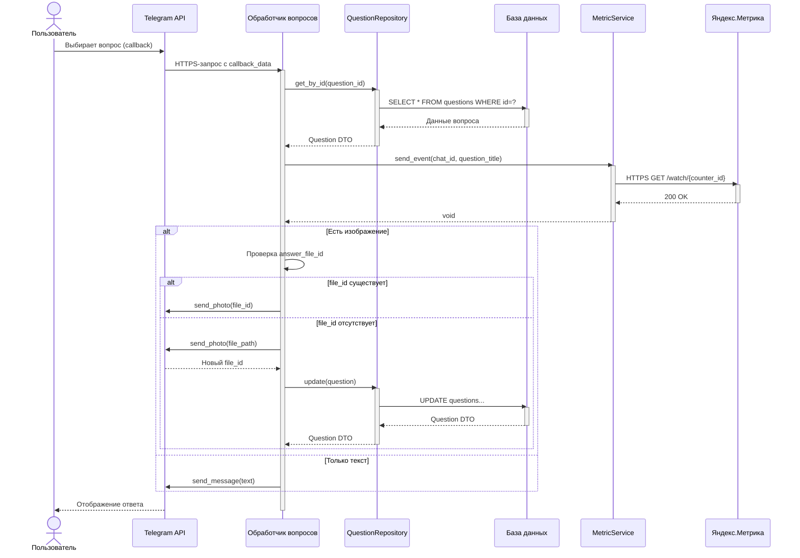

## Диаграмма обработки вопроса

Диаграмма последовательности визуализирует детальный путь обработки запроса в Telegram-боте, когда пользователь выбирает определенный вопрос. Она показывает, как происходит взаимодействие между элементами системы: от нажатия на кнопку до получения ответа и фиксации события в Яндекс Метрике.
Начало процесса – нажатие пользователем на кнопку с нужным вопросом. Telegram передает callback-запрос на сервер, где работает обработчик. Затем выполняются следующие действия:

    1. Извлечение текста ответа из базы данных посредством QuestionRepository;
    
    2. Передача информации о событии в Яндекс Метрику через MetricService;
    
    3. Проверка наличия изображения в ответе;
    
        - При наличии сохраненного изображения (file_id) оно отправляется без дополнительной обработки;
        
        - В противном случае, изображение загружается и сохраняется в базе данных;
        
    4. Передача ответа конечному пользователю, в виде текста или изображения.

Данная схема позволяет наглядно представить цепочку вызовов и обмен данными между компонентами системы и внешними сервисами, что особенно полезно для понимания логики формирования ответа на запрос пользователя.

